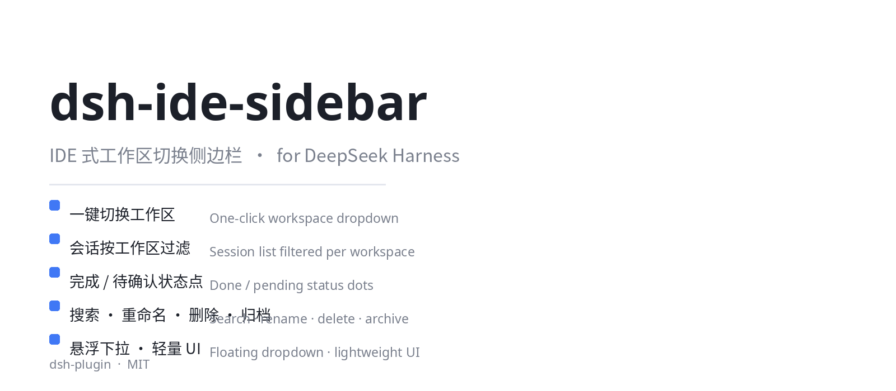

# dsh-ide-sidebar

<p align="center">
  
</p>

> IDE 式工作区切换侧边栏插件（Web / 浏览器 GUI 客户端 bundle）
> IDE-style workspace switcher sidebar for DSH (DeepSeek Harness).

将 DSH 默认侧边栏替换为 **IDE 式工作区切换器**：左上角悬浮下拉一键切换工作区，下方会话列表随工作区过滤，用状态灯直观标记完成 / 待确认，并提供工作区 / 会话搜索、创建工作区、重命名、删除、归档等能力。

> `dsh-plugin` 生态：本插件已遵循 [DeepSeek Harness 官方贡献规范](https://github.com/deepseek-ai/deepseek-harness/blob/master/CONTRIBUTING.md)，以实现分发包的形式发布，给仓库打上 `dsh-plugin` topic 以便发现。

## Overview

**解决什么问题？** DSH Web GUI 原生侧边栏以全局会话列表为主，缺少多工作区的高效导航。对日常同时维护多个工作区（项目）的用户，频繁来回切换会话成本高。本插件把侧边栏升级为类 IDE 的工作区视角：

- 顶部悬浮下拉，当前工作区一目了然，一键切换；
- 会话按工作区过滤，只看到当前上下文相关的会话；
- 每个会话带状态灯（完成 🔵 / 待确认 🟠），扫描进度一目了然；
- 内置搜索：既搜工作区，也搜会话；支持重命名 / 删除 / 归档 / 新建工作区。

**适合谁？** 需要多工作区并行、频繁切换的 DSH Web GUI 重度用户 / Agent 开发者。

## Features

- 左上角悬浮下拉工作区切换器（`idebar-switcher`）
- 会话列表按工作区过滤
- 三级状态灯：完成（brand 蓝）/ 待确认（warn 琥珀，脉冲动效）
- 工作区搜索 + 会话搜索
- 工作区管理：添加、重命名、删除、归档
- 会话管理：重命名、删除
- 纯浏览器端 bundle，无 host 行为，无额外服务端依赖

## Compatibility

- **平台**：仅 `web`（DSH 浏览器 GUI）
- **DSH 版本**：`dsh >= 0.1.0-rc`（对齐 `@deepseek-ai/dsh-client-runtime` 与 `dsh-client-ui-sidebar` 的当前 RC 接口）
- **注入依赖**：`@deepseek-ai/dsh-client-runtime`、`@deepseek-ai/dsh-client-ui-sidebar`（由 run時の注入 seam 提供；`react >= 17` 作为 peerDependency）
- **驱动说明**：本仓库为独立 bundle（`cordis.patch.yml` + `lib/`），不修改官方包源码
- **最后验证**：v0.1.0 于 2026-08 在 `web` profile 实测加载成功
- ⚠️ 不含"出错红灯"功能（该功能依赖动态插件 host RPC，常驻 bundle 无此通道）

## Install / Uninstall

### 安装（方式一：`dsh plugin`，推荐）

```bash
cd "$DSH_HOME/profiles/web"
dsh plugin --profile web add dsh-ide-sidebar
```

然后把 `dsh-ide-sidebar` 追加到该 profile `package.json` 的 `dsh.profile.bundles` 末尾，重启 `dsh web`。

### 安装（方式二：手动挂载）

1. 将本插件目录放入 pnpm 可解析位置，并在 `$DSH_HOME/profiles/node_modules/dsh-ide-sidebar` 建立符号链接（hoisted 布局）；
2. 在 profile 的 `package.json`：
   - `dependencies` 加 `"dsh-ide-sidebar": "*"`
   - `dsh.profile.bundles` 数组追加 `"dsh-ide-sidebar"`
3. 重启 `dsh web`。

> ⚠️ 所有写入的配置文件务必 **UTF-8 无 BOM**。

### 卸载

1. 从 profile `package.json` 的 `bundles` 数组中移除 `dsh-ide-sidebar` 行；
2. 移除 `dependencies` 中的对应依赖；
3. 删除 `$DSH_HOME/profiles/node_modules/dsh-ide-sidebar` 链接；
4. 重启 `dsh web`。

## Quick start

1. 按上文任一方式安装并重启 `dsh web`；
2. 打开 Web GUI，左上角出现当前工作区名 + 下拉箭头；
3. 点击下拉 → 在工作区之间切换，或搜索 / 新建 / 重命名 / 归档工作区；
4. 会话列表当前工作区过滤，观察状态灯：🔵 已完成，🟠 待确认。

## Configuration

本插件 **无配置项**，全部行为内建。注入的 DSH service（`@deepseek-ai/dsh-client-runtime`、`@deepseek-ai/dsh-client-ui-sidebar`）由运行环境自动提供，不读环境变量、无用户数据。

> 若后续需要，会在此新增 `dsh-ide-sidebar` 配置命名空间。

## Permissions & data

- 纯浏览器侧插件，`apply()`（Host half）为空实现，**不访问宿主进程、不读写文件系统、不触碰本地凭据**；
- 读取 DSH 客户端运行时已暴露的 `Session` / `Workspace` 列表（由 `dsh-client-runtime` 注入）以渲染 UI；
- 所有会话操作（归档 / 重命名 / 删除 / 新建）均通过 DSH 已授权的客户端接口执行，本插件不新增网络出口；
- 不收集任何日志与遥测；
- 主题遵循 DSH 的 design tokens（`--dsw-*`），无外部请求。

## Troubleshooting

| 症状 | 可能原因 | 处理 |
|---|---|---|
| 侧边栏未变化 | 未加入 `bundles` 或 web 未重启 | 确认 `dsh.profile.bundles` 含 `dsh-ide-sidebar` 并重启 `dsh web` |
| 疑似依赖未注入 | profile 缺 `dsh-client-runtime` / `dsh-client-ui-sidebar` | 这些是 run 自带 bundle，确认 profile 以 `dsh-base` 起步 |
| 图标 / 样式错乱 | 主题 tokens 与当前 DSH 主题不匹配 | 反馈 Issue 并提供 DSH 版本与主题名 |
| BOM 出错导致加载失败 | 配置文件被写入了 BOM | 用无 BOM 编码重写 package.json，重启 |

遇其它问题，请到仓库 [Issues](https://github.com/yuhangkang/dsh-ide-sidebar/issues) 反馈，附 DSH 版本、web 控制台报错与截图。

## Development

```bash
git clone https://github.com/yuhangkang/dsh-ide-sidebar.git && cd dsh-ide-sidebar
# 本插件为普通 JS bundle，无需 TypeScript 编译
# 本地验证：参照「方式二」手动挂载到 profile 后重启 web
```

- 入口 `lib/index.mjs`（Host，空实现）
- 客户端 UI `lib/client.js`（React，通过 `window.__ModuleLoader__` 加载）
- 类型 `lib/index.d.mts`
- 挂载点 `cordis.patch.yml` → `insert ide-sidebar`

贡献（Contribute）：欢迎 Issue 与 PR。

## License & Security

- **License**：MIT
- **Security**：安全问题请私信仓库维护者，避免在公开 Issue 中泄露凭据 / 私有信息。
- 第三方插件会以 your own permissions 运行——源码自审，勿在存放敏感 key 的环境乱试陌生插件。

---

**仓库**：https://github.com/yuhangkang/dsh-ide-sidebar
**Topics**：`dsh-plugin`、`deepseek-harness`、`dsh` —— 可在 [github.com/topics/dsh-plugin](https://github.com/topics/dsh-plugin) 被发现。